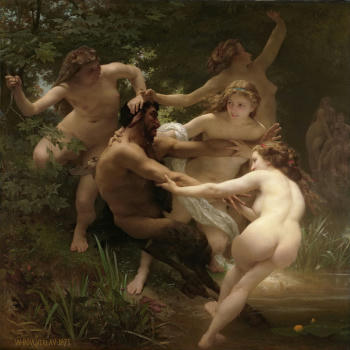

# Sembra

Seam carving: content-aware image resizing.

## About

Seam carving is a content-aware image resizing technique that resizes an image by
removing or adding pixels in the least noticeable areas. The technique was first
developed by [Shai Avidan and Ariel Shamir in 2007](https://dl.acm.org/doi/abs/10.1145/1275808.1276390). 
The technique was later improved by [Michael Rubinstein, Ariel Shamir, and Shai Avidan in 2008](https://dl.acm.org/doi/abs/10.1145/1360612.1360615).

The rust code in this repository is a port of the [Python code](https://github.com/li-plus/seam-carving) by [Jiahao Li](https://liplus.me/).
Fun fact, the port was done by the o1 model from OpenAI. It was nearly correct, and only two small bugs required fixing.

## CLI Usage

```sh
$ sembra --help
CLI for our seam carving demo

Usage: sembra [OPTIONS] --input <INPUT> --output <OUTPUT>

Options:
      --input <INPUT>              Input image path
      --output <OUTPUT>            Output image path
      --width <WIDTH>              Target width
      --height <HEIGHT>            Target height
      --energy-mode <ENERGY_MODE>  Energy mode: "backward" or "forward" [default: backward]
      --order <ORDER>              Order mode: "width-first" or "height-first" [default: width-first]
      --keep-mask <KEEP_MASK>      Keep mask image path (optional)
      --drop-mask <DROP_MASK>      Drop mask image path (optional)
      --step-ratio <STEP_RATIO>    Step ratio for expansions [default: 0.5]
  -h, --help                       Print help
  -V, --version                    Print version
```

## Examples

Generally speaking, you get the best results if you go smaller. It is quite impressive
how well this works. Here is an example of resizing a rectangular image down into a
square. We'll use the famous painting <em>Nymphs and Satyr (1873)</em> by William-Adolphe Bouguereau:

```bash
$ sembra --input nes.jpg --output nes_big_square.jpg \
    --width 350 --height 350 --energy-mode forward
```

<table>
  <tr>
    <td>
      
      <p align="center">Original 350x500</p>
    </td>
    <td>
      
      <p align="center">Reduced 350x350</p>
    </td>
  </tr>
</table>

We turned a rectangular image into a square with very little observable distortion!
Quite remarkable.

You can also go bigger, but the results are not as good. Here is an example of the same
image, but this time we enlarge the width to make it square:

```bash
$ sembra --input nes.jpg --output nes_big_square.jpg \
    --width 500 --height 500 --energy-mode forward
```

<table>
  <tr>
    <td>
      
      <p align="center">Original 350x500</p>
    </td>
    <td>
      
      <p align="center">Enlarged 500x500</p>
    </td>
  </tr>
</table>

While there is clearly some distortion, there is also excellent preservation
of some of the more detailed parts of the image. This is what seam carving
gives you. You can see this by comparing the seam-carving enlargement versus what
you get from a typical image resize (resampling) in an image editor:

<table>
  <tr>
    <td>
      
      <p align="center">Seam-carved up 500x500</p>
    </td>
    <td>
      
      <p align="center">Resampling 500x500</p>
    </td>
  </tr>
</table>

Side-by-side, you can clearly see that the seam-carving enlargment has preserved
detail in key areas, like faces, fingers, eyes, and so on. Of course, this comes
at the cost greater distortion in other less detailed areas.
